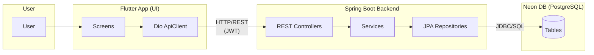
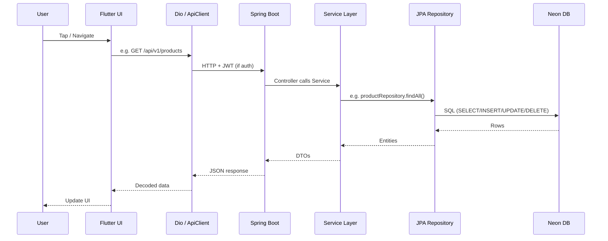
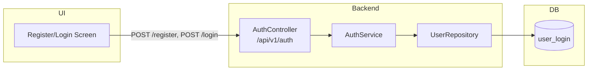
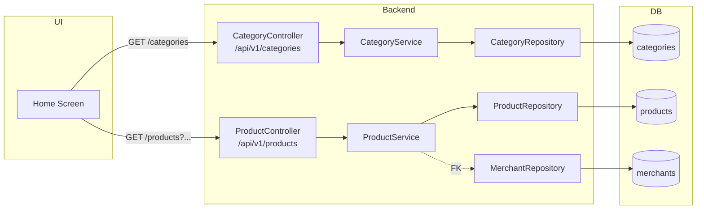
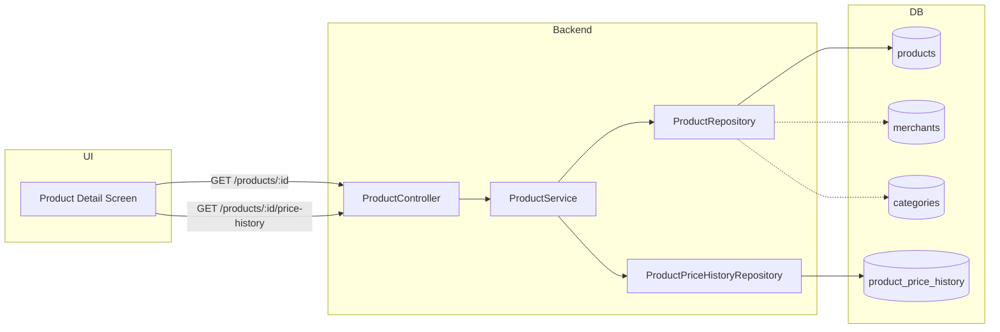
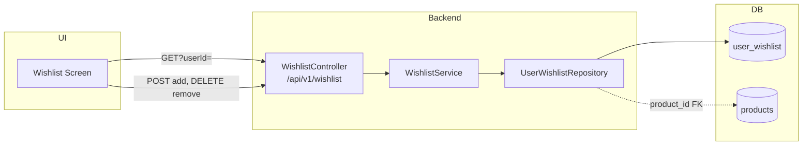
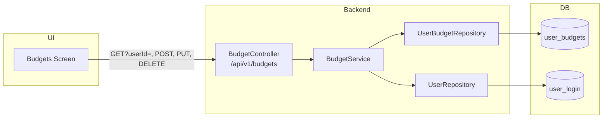
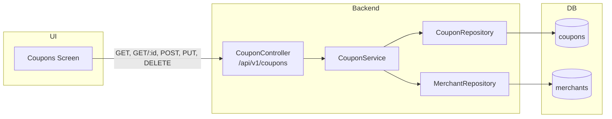
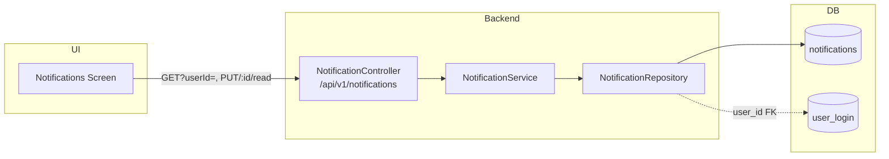
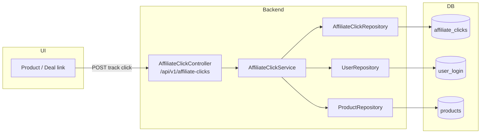

# SnatchMart – Flow Diagram: UI → Backend → Neon DB

This document describes how the user interacts with the Flutter UI, how the Spring Boot backend is invoked, and how Neon (PostgreSQL) is used with the relevant tables.

---

## 1. High-Level Architecture



- **User** uses the Flutter app (login, home, products, wishlist, coupons, etc.).
- **Flutter** uses **Dio** with base URL (e.g. `http://127.0.0.1:8081`), **JWT** in headers, and calls **REST** endpoints.
- **Spring Boot** exposes **REST** → **Services** → **JPA Repositories** → **Neon DB**.

---

## 2. Request Flow (Single Action)



---

## 3. Feature Flows and Tables Used

### 3.1 Authentication (Register / Login)



| Action        | API                    | Backend → DB        | Table(s)   |
|---------------|------------------------|---------------------|------------|
| Register      | `POST /api/v1/auth/register` | AuthService → UserRepository | **user_login** (INSERT) |
| Login         | `POST /api/v1/auth/login`   | AuthService → UserRepository | **user_login** (SELECT by email) |

---

### 3.2 Home: Categories and Top Deals (Products)



| Action           | API                         | Tables used                               |
|------------------|-----------------------------|-------------------------------------------|
| Load categories  | `GET /api/v1/categories`    | **categories**                            |
| Load products    | `GET /api/v1/products`      | **products**, **merchants**, **categories** (via FKs) |

---

### 3.3 Product Detail and Price History



| Action            | API                                  | Tables used                                      |
|------------------|--------------------------------------|--------------------------------------------------|
| Product by ID     | `GET /api/v1/products/{id}`          | **products**, **merchants**, **categories**      |
| Price history     | `GET /api/v1/products/{id}/price-history` | **product_price_history**, **products**     |

---

### 3.4 Wishlist



| Action      | API                          | Tables used                |
|-------------|------------------------------|----------------------------|
| Get list    | `GET /api/v1/wishlist?userId=`  | **user_wishlist**, **products** |
| Add         | `POST /api/v1/wishlist`       | **user_wishlist** (INSERT) |
| Remove      | `DELETE /api/v1/wishlist?userId=&productId=` | **user_wishlist** (DELETE) |

---

### 3.5 Budgets



| Action   | API                                | Tables used                    |
|----------|------------------------------------|--------------------------------|
| List     | `GET /api/v1/budgets?userId=`      | **user_budgets**, **user_login** |
| Create   | `POST /api/v1/budgets`             | **user_budgets**, **user_login** |
| Update   | `PUT /api/v1/budgets/{id}`         | **user_budgets**               |
| Delete   | `DELETE /api/v1/budgets/{id}`       | **user_budgets**               |

---

### 3.6 Coupons



| Action | API                           | Tables used        |
|--------|-------------------------------|--------------------|
| List   | `GET /api/v1/coupons`         | **coupons**, **merchants** |
| By ID  | `GET /api/v1/coupons/{id}`    | **coupons**        |
| Create/Update/Delete | POST/PUT/DELETE | **coupons**, **merchants** |

---

### 3.7 Notifications



| Action   | API                                    | Tables used          |
|----------|----------------------------------------|----------------------|
| List     | `GET /api/v1/notifications?userId=`    | **notifications**, **user_login** |
| Mark read| `PUT /api/v1/notifications/{id}/read`  | **notifications** (UPDATE) |

---

### 3.8 Affiliate Click (Track Outbound Clicks)



| Action | API                              | Tables used                                   |
|--------|----------------------------------|-----------------------------------------------|
| Track  | `POST /api/v1/affiliate-clicks`  | **affiliate_clicks**, **user_login**, **products** |

---

### 3.9 User Management (Profile / Referrals)

| Action        | API (e.g. UserSignUpController)     | Tables used     |
|---------------|-------------------------------------|-----------------|
| Create user   | `POST /api/v1/users`                | **user_login**  |
| Update user   | `PUT /api/v1/{id}`                  | **user_login**  |
| Get user      | `GET /api/v1/{id}`                  | **user_login**  |
| Get by referral code | `GET /api/v1/referral/{code}` | **user_login**  |
| Referrals by user   | `GET /api/v1/{id}/referrals`  | **user_login** (self-references) |
| Login         | `POST /api/v1/login`                | **user_login**  |

---

## 4. Database Tables and Relationships

```mermaid
erDiagram
    user_login ||--o{ user_login : "referred_by_id"
    user_login ||--o{ user_wishlist : "user_id"
    user_login ||--o{ user_budgets : "user_id"
    user_login ||--o{ notifications : "user_id"
    user_login ||--o{ affiliate_clicks : "user_id"

    merchants ||--o{ products : "merchant_id"
    merchants ||--o{ coupons : "merchant_id"
    merchants ||--o{ affiliate_clicks : "merchant_id"

    categories ||--o{ categories : "parent_id"
    categories ||--o{ products : "category_id"

    products ||--o{ product_sales_events : "product_id"
    products ||--o{ user_wishlist : "product_id"
    products ||--o{ product_price_history : "product_id"
    products ||--o{ affiliate_clicks : "product_id"

    sales_events ||--o{ product_sales_events : "sales_event_id"

    user_login {
        uuid id PK
        email_id
        username
        password_hash
        referral_code
        referred_by_id FK
    }

    merchants {
        uuid id PK
        name
        logo_url
    }

    categories {
        uuid id PK
        name
        slug
        parent_id FK
    }

    products {
        uuid id PK
        product_name
        sale_price
        merchant_id FK
        category_id FK
        affiliate_url
    }

    user_wishlist {
        user_id PK,FK
        product_id PK,FK
    }

    user_budgets {
        uuid id PK
        user_id FK
        product_name
        target_price
    }

    coupons {
        uuid id PK
        code
        discount_type
        merchant_id FK
    }

    notifications {
        uuid id PK
        user_id FK
        message
        is_read
    }

    affiliate_clicks {
        uuid id PK
        user_id FK
        product_id FK
        merchant_id FK
    }

    product_price_history {
        uuid id PK
        product_id FK
        price
        recorded_at
    }

    sales_events { uuid id PK }
    product_sales_events { product_id FK, sales_event_id FK }
```

---

## 5. Summary: UI → Backend → Neon

| Layer        | Role |
|-------------|------|
| **User**    | Uses Flutter app (login, browse, wishlist, budgets, coupons, notifications). |
| **Flutter** | Screens + Dio `ApiClient` (base URL, JWT). Calls REST endpoints. |
| **Backend** | Spring Boot: Controllers → Services → JPA Repositories. Returns JSON. |
| **Neon DB** | PostgreSQL. Tables: `user_login`, `merchants`, `categories`, `products`, `sales_events`, `product_sales_events`, `coupons`, `affiliate_clicks`, `user_wishlist`, `user_budgets`, `product_price_history`, `notifications`. |

Connection to Neon is configured via Spring DataSource (e.g. `spring.datasource.url` with Neon connection string). JPA/Hibernate map entities to these tables; Repositories generate SQL; Neon executes it and returns results.
